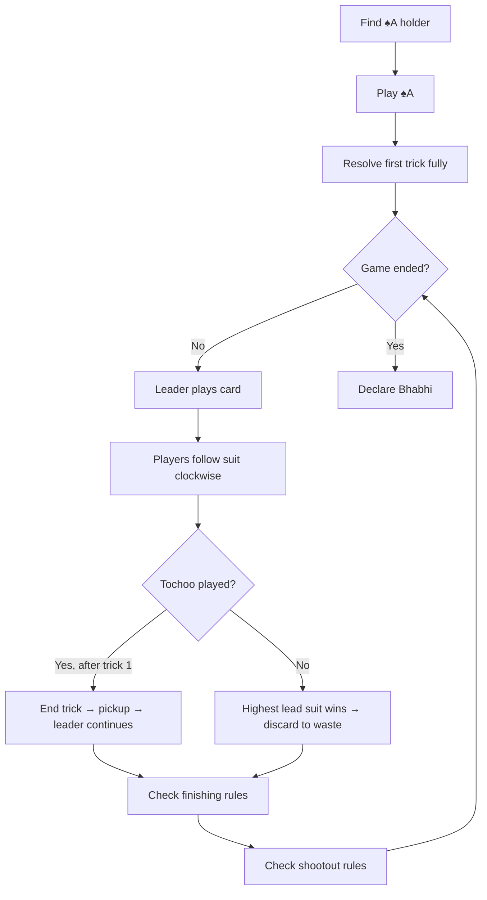

# 🎴 Bhabhi - Game Rules

> **Official specification for the traditional Indian card game**
> This document is the authoritative source of truth. Implement exactly as specified—no additional rules or interpretations.

---

## 📋 Table of Contents
- [Game Overview](#-game-overview)
- [Players](#-players)
- [Deck](#-deck)
- [Dealing](#-dealing)
- [Starting the Game](#-starting-the-game)
- [Game Structure](#-game-structure)
- [Core Gameplay](#-core-gameplay)
  - [Leading a Trick](#leading-a-trick-power)
  - [Following Suit](#following-suit)
  - [First Trick Exception](#first-trick-exception-critical)
  - [Tochoo Rule](#tochoo-thulla-rule)
  - [Clean Trick](#clean-trick-no-tochoo)
- [Finishing & Victory](#-finishing--victory)
- [Shootout Mode](#-shootout-mode)
- [End Game](#-end-game)
- [Turn Flow](#-turn-flow-summary)
- [Implementation Constraints](#-implementation-constraints)

---

## 🎯 Game Overview

**Bhabhi** is a multiplayer, trick-based card game where the goal is to get rid of all your cards.

| Objective | Players who successfully empty their hand "get away" |
|-----------|-----------------------------------------------------|
| Loser     | The last remaining player is the **Bhabhi** (loser) |
| Type      | Trick-taking, shedding game                         |

---

## 👥 Players

| Property | Value |
|----------|-------|
| Minimum  | 2     |
| Maximum  | 8     |

### Player Structure

```typescript
interface Player {
  id: number;
  hand: Card[];
  hasFinished: boolean;
  hasPower: boolean;
}
```

> **Note:** Finished players are skipped from all future play.

---

## 🃏 Deck

- **Standard 52-card deck** (no jokers)
- **Card ranking applies only within the same suit**

### Card Structure

```typescript
interface Card {
  suit: "spades" | "hearts" | "diamonds" | "clubs";
  rank: 2–14;  // Jack=11, Queen=12, King=13, Ace=14
}
```

---

## 🔀 Dealing

1. Shuffle the deck
2. Deal **all cards** to players
3. Unequal hand sizes are allowed (difference ≤ 1 card)

---

## 🚀 Starting the Game

### Mandatory First Move

| Rule | Description |
|------|-------------|
| Starter | The player holding the **Ace of Spades (♠A)** |
| First Card | **Must** play ♠A as the lead card |
| Restriction | No other opening move is allowed |

---

## 🎮 Game Structure

The game is played as a sequence of **tricks**.

### Trick Structure

```typescript
interface Trick {
  leaderId: number;      // Player who started the trick
  leadSuit: Suit;        // The suit that must be followed
  playedCards: TrickCard[];  // Cards played in this trick
}
```

---

## 🎲 Core Gameplay

### Leading a Trick (Power)

The player with **power** leads the trick.

**Power means:**
- ✅ You start the next trick
- ✅ Play exactly **one card**
- ✅ That card's suit becomes the **lead suit**

---

### Following Suit

| Turn Order | Clockwise |
|------------|-----------|

**Each active player must:**

1. **Follow the lead suit if possible**
2. **If no cards of lead suit:** Play any other card
   - This is called a **tochoo** (थुल्ला) or **thulla**

> ⚠️ **No passing in this game**

---

### First Trick Exception (Critical)

```
⚠️ EXCEPTION: The first trick ALWAYS completes fully
```

**Even if a tochoo is played:**
- ✅ All players still play a card
- ❌ The trick does NOT end early

> This exception applies **ONLY** to the first trick.

---

### Tochoo (Thulla) Rule

**Applies from the second trick onward**

#### When a Tochoo is Played

```
Player 1 (Leader): 5♠
Player 2: 7♠
Player 3: 2♣  ← TOCHOO! (different suit)
Trick ends immediately
```

#### Resolution

1. ⏹️ **Trick ends immediately**
2. 🚫 Remaining players do not participate
3. 🔍 Determine the **highest card** of the lead suit played so far
4. 👤 The player who played that card:
   - 📥 Picks up all cards in the trick
   - ➕ Adds them to their hand
   - 👑 Keeps power
   - ▶️ Leads the next trick

> **Note:** Only the first tochoo matters; multiple tochoos in one trick are impossible.

---

### Clean Trick (No Tochoo)

**If all players follow suit:**

1. 🔍 Determine the **highest card** in the lead suit
2. 👤 That player:
   - 👑 Gains power
   - ▶️ Leads next trick
3. 🗑️ All cards from the trick:
   - Go to the **waste pile**
   - Removed from active play

---

## 🏆 Finishing & Victory

### Normal Play (More than 2 players left)

| Condition | Playing your last card |
|-----------|------------------------|
| Result    | ✅ Immediately get away |
| Power     | ❌ Does NOT matter      |
| Restriction | None                 |

```typescript
player.hasFinished = true;
```

---

## ⚔️ Shootout Mode

### Definition

Shootout begins when **exactly 2 active players** remain.

```typescript
activePlayers.length === 2
```

### Power Restriction Rule (Shootout ONLY)

> ⚠️ **This rule applies ONLY during shootout**

#### If a player:
1. ✅ Empties their hand
2. **AND** ✅ Still has power

#### Then they must:
1. 🃏 Draw exactly **one card** from the waste pile
2. ▶️ Immediately lead the next trick with that card

> They may only get away when they finish **without holding power**.

### Waste Pile Invariant

| Before First Trick | May be empty ⚪ |
|--------------------|----------------|
| After First Trick  | Guaranteed non-empty ✅ |

> Any rule that draws from the waste pile is always safe after trick 1.

---

## 🏁 End Game

The game ends when **one player remains**.

| Result | Description |
|--------|-------------|
| Winners | All players who got away (n-1 players) |
| Bhabhi  | The remaining/losing player |

---

## 🔄 Turn Flow Summary



### Pseudocode

```typescript
// 1. Find ♠A holder → play ♠A
// 2. Resolve first trick fully
WHILE (!gameEnded) {
  // Leader plays card
  // Players follow suit clockwise

  IF (tochoo && trickNumber > 1) {
    // End trick → pickup → leader continues
  } ELSE {
    // Highest lead suit wins → discard to waste
  }

  // Check finishing rules
  // Check shootout rules
}
```

---

## ⚙️ Implementation Constraints

| Constraint | Description |
|------------|-------------|
| ❌ No passing | Players must always play a card |
| 1️⃣ One card per turn | Exactly one card played per turn |
| ⏭️ Skip finished players | Finished players are skipped from play |
| 🗑️ Waste pile guarantee | Non-empty after trick 1 |
| 🚫 No hidden rules | No penalties, bonuses, or undocumented features |

---

## 📝 Final Instruction

> **Do not introduce any additional mechanics, interpretations, or variants.**
> Implement exactly what is written in this specification.

---

## 📊 Quick Reference

| Term | Definition |
|------|------------|
| **Bhabhi** | The loser (last remaining player) |
| **Tochoo/Thulla** | Playing a card of different suit when you can't follow |
| **Power** | The right to lead the next trick |
| **Get Away** | Successfully emptying your hand and finishing the game |
| **Clean Trick** | A trick where all players follow suit |
| **Shootout** | The final phase when only 2 players remain |
| **Waste Pile** | Discarded cards from clean tricks |
